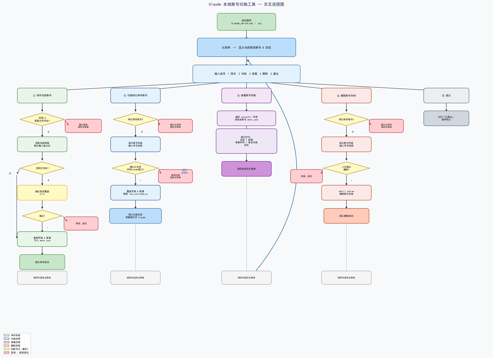

# cc-account-switcher

Windows 本地 Claude 多账号快速切换工具。通过快照备份 `~/.claude` 凭据，实现不同账号一键切换，仅依赖 Python 标准库。

---

## 环境要求

- Windows 10 / 11
- Python 3.10+（无需额外安装第三方库）

---

## 快速开始

双击 `claude_switch.bat`，或在终端执行：

```bat
python claude_switch.py
```

---

## 功能说明

| 菜单选项 | 功能描述 |
|---------|---------|
| ① 保存当前账号 | 将当前 Claude 凭据快照保存到本地，可自定义备注名 |
| ② 切换到已保存账号 | 从已保存快照中选择并切换，自动替换凭据文件 |
| ③ 查看账号列表 | 列出所有已保存账号及其邮箱、更新时间、最近切换时间 |
| ④ 删除账号存档 | 选择并删除指定账号的本地快照（二次确认） |
| ⑤ 退出 | 退出程序 |

---

## 交互流程



---

## 注意事项

- **切换账号前，请先关闭所有 Claude 相关窗口**，程序会要求你确认后才会继续
- 账号快照保存在脚本同目录下的 `accounts/` 文件夹，该目录仅存于本地，不会上传
- 危险操作（覆盖保存、删除存档）均有二次确认，误操作可直接取消

---

## 文件结构

```
cc-account-switcher/
├── claude_switch.py   # 核心逻辑
├── claude_switch.bat  # Windows 快速启动入口
├── flowchart.jpg      # 交互流程图
└── accounts/          # 账号快照目录（本地自动生成，不上传）
    └── 账号备注名/
        ├── credentials.json
        ├── config.json
        └── meta.json
```
